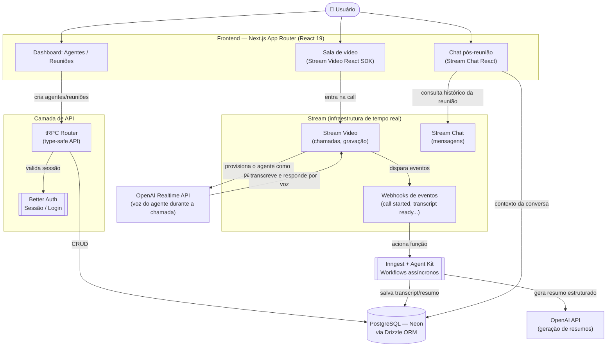

<div align="center">

# 🤖 Meet AI

### Plataforma de videoconferência SaaS com agentes de IA que participam das reuniões em tempo real

[](https://nextjs.org)
[](https://react.dev)
[](https://www.typescriptlang.org)
[](https://trpc.io)
[](https://orm.drizzle.team)
[](https://neon.tech)
[](https://www.better-auth.com)
[](https://getstream.io)
[](https://www.inngest.com)
[](https://openai.com)

</div>

---

## 📋 Sobre o projeto

**Meet AI** é uma plataforma SaaS de videoconferência onde o usuário pode criar **agentes de IA personalizados** — com instruções e "personalidade" próprias — que **participam ativamente das reuniões em tempo real**: ouvem, respondem por voz e mantêm contexto da conversa. Ao final da chamada, a plataforma gera automaticamente um **resumo estruturado** da reunião e permite que o usuário **continue a conversa com o agente** sobre o que foi discutido.

> 💡 Este README foi elaborado a partir do `package.json` real do repositório, da estrutura de pastas pública (`src/`, `public/`, `drizzle.config.ts`) e do padrão de arquitetura conhecido de projetos "Meet AI" equivalentes (Next.js + Stream + tRPC + Drizzle/Neon + Better Auth + Inngest + OpenAI). Ajuste os detalhes finos conforme a implementação exata do seu fork.

---

## ✨ Funcionalidades

| Funcionalidade | Descrição |
|---|---|
| 🧠 **Agentes de IA customizáveis** | Criação de agentes com instruções e personalidade próprias para diferentes tipos de reunião |
| 🎥 **Videochamadas em tempo real** | Chamadas de alta qualidade via Stream Video, com o agente de IA como participante ativo |
| 🗣️ **Resposta por voz em tempo real** | Pipeline de transcrição + OpenAI Realtime API para o agente responder durante a própria chamada |
| 📝 **Transcrição ao vivo** | Transcrição automática com identificação de quem está falando |
| 🎬 **Gravações automáticas** | Gravação da chamada com conteúdo pesquisável |
| 📊 **Resumos pós-reunião** | Geração assíncrona (via Inngest + Agent Kit) de resumos estruturados com os principais pontos da reunião |
| 💬 **Chat pós-reunião** | Interface de chat (Stream Chat) para continuar conversando com o agente sobre o conteúdo da reunião |
| 🔐 **Autenticação completa** | Login/sessão via Better Auth |
| ⚡ **API type-safe** | Camada de API com tRPC + TanStack Query, ponta a ponta tipada |
| 🖼️ **Avatares gerados** | Avatares de agentes/usuários gerados via Dicebear |

---

## 🛠️ Tech Stack

| Camada | Tecnologia |
|---|---|
| **Framework** | Next.js 15 (App Router), React 19 |
| **UI** | Tailwind CSS 4, Radix UI, shadcn/ui, `cmdk`, `sonner`, `vaul` |
| **API** | tRPC (client/server) + TanStack Query |
| **Banco de dados** | PostgreSQL (Neon serverless) |
| **ORM** | Drizzle ORM + Drizzle Kit (migrations/studio) |
| **Autenticação** | Better Auth |
| **Vídeo & Chat em tempo real** | Stream Video SDK (`@stream-io/video-react-sdk`, `@stream-io/node-sdk`) + Stream Chat (`stream-chat`, `stream-chat-react`) |
| **IA conversacional (tempo real)** | OpenAI Realtime API via `@stream-io/openai-realtime-api` |
| **IA (resumos/summaries)** | OpenAI SDK + `@inngest/agent-kit` |
| **Jobs / eventos assíncronos** | Inngest |
| **Avatares** | Dicebear |
| **Formulários & validação** | React Hook Form + Zod |
| **Tabelas / dados** | TanStack Table, Recharts |
| **Dev tooling** | ngrok (túnel para webhooks do Stream em desenvolvimento) |
| **Linguagem** | TypeScript 5 |

---

## 🏗️ Arquitetura



### Como funciona o fluxo

1. O usuário se autentica (**Better Auth**) e, pelo **dashboard**, cria **agentes de IA** (nome, instruções, personalidade) e agenda **reuniões**, tudo via **tRPC** com validação de tipos ponta a ponta.
2. Ao iniciar uma reunião, o backend **provisiona o agente de IA como participante ativo** da chamada usando o **Stream Video SDK** (server-side, via `@stream-io/node-sdk`).
3. Durante a chamada, o áudio passa por um **pipeline de transcrição em tempo real**, e a **OpenAI Realtime API** gera as respostas de voz do agente enquanto a conversa acontece — não depois.
4. O **Stream** dispara **webhooks** conforme eventos da chamada ocorrem (início, fim, transcrição pronta). Em desenvolvimento, esses webhooks chegam via um túnel **ngrok** (`dev:webhook`).
5. Esses eventos acionam funções do **Inngest**, que processam o transcript de forma assíncrona — sem travar a aplicação ao vivo — usando **Agent Kit** e a **API da OpenAI** para gerar um **resumo estruturado** da reunião.
6. Resumo, transcript e metadados são persistidos no **PostgreSQL (Neon)** via **Drizzle ORM**.
7. Após a reunião, o usuário pode abrir o **chat** (Stream Chat) e continuar a conversa com o agente, que tem acesso ao contexto da reunião registrada.

> Ajuste nomes de tabelas, rotas tRPC e funções do Inngest conforme a implementação real em `src/`.

---

## 📁 Estrutura do projeto

```
nextjs-meet-ai/
├── public/                  # Assets estáticos
├── src/                     # Código-fonte (App Router, componentes, tRPC routers, lib)
├── components.json          # Configuração do shadcn/ui
├── drizzle.config.ts        # Configuração do Drizzle ORM / Drizzle Kit
├── eslint.config.mjs
├── next.config.ts
├── postcss.config.mjs
├── tsconfig.json
├── package.json
└── README.md
```

## 📜 Scripts disponíveis

| Comando | Descrição |
|---|---|
| `npm run dev` | Inicia o servidor de desenvolvimento |
| `npm run build` | Gera o build de produção |
| `npm run start` | Inicia o servidor em modo produção |
| `npm run lint` | Roda o ESLint no projeto |
| `npm run db:push` | Aplica o schema do Drizzle no banco de dados |
| `npm run db:studio` | Abre o Drizzle Studio (UI de administração do banco) |
| `npm run dev:webhook` | Expõe `localhost:3000` via ngrok para receber webhooks do Stream |

---

## 🗺️ Roadmap

- [ ] Documentar o schema do Drizzle (`src/db`)
- [ ] Mapear todos os routers tRPC e suas procedures
- [ ] Detalhar as funções do Inngest (`src/inngest` ou equivalente)
- [ ] Adicionar testes automatizados
- [ ] Definir licença do projeto

---


<div align="center">

Feito por [@renatomf](https://github.com/renatomf)

</div>
